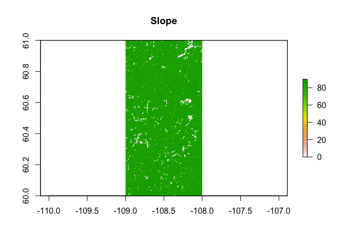
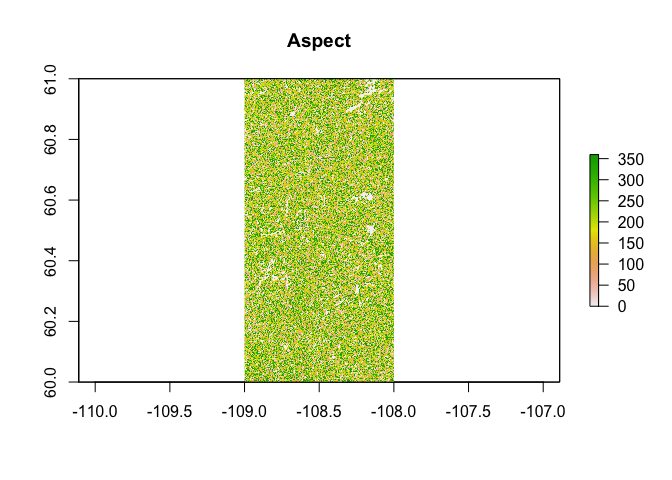

# Overview

This repository contains an R function for calculating the slope and
aspect from a Digital Elevation Model (DEM) using the `raster` package.
The function `calculate_slope_aspect` takes a raster object representing
the DEM as input and returns two raters representing slope and aspect.

## Function description

### Function used

calculate_slope_aspect(dem)

## Input

DEM for North Western Territories (NWT): A raster object representing
the Digital Elevation Modelof North Western Territory for Canada in
2022.

### Output

list (slope, aspect): A list containing two rasters:

- slope: A raster representing the calculated slope in degrees.
- aspect: A raster representing the calculated aspect in degrees.

## Usage

### Load the raster package:

\#install.packages(“raster”)

``` r
library(raster)
```

    ## Loading required package: sp

### Load the DEM of NWT

``` r
elevation_raster <- raster("/Users/chinyereottah/Desktop/Env/TopographyR/data-raw/NWTDEM_2022.tif")
```

### Use the function which was derived

``` r
calculate_slope_aspect <- function(dem) {
  # Calculate slope
  dzdx <- focal(dem, matrix(c(-1,0,1,-2,0,2,-1,0,1), nrow=3, ncol=3),
                fun=function(x) {sum(x)})

  dzdy <- focal(dem, matrix(c(1,2,1,0,0,0,-1,-2,-1), nrow=3, ncol=3),
                fun=function(x) {sum(x)})

  slope <- atan(sqrt(dzdx^2 + dzdy^2))

  # Convert slope to degrees
  slope <- slope * (180 / pi)

  # Calculate aspect
  aspect <- atan2(dzdy, -dzdx)

  # Convert aspect to degrees
  aspect <- (aspect * (180 / pi) + 360) %% 360

  return(list(slope = slope, aspect = aspect))
}
## example of how you can use this function

# Load DEM
elevation_raster <- raster("/Users/chinyereottah/Desktop/Env/TopographyR/data-raw/NWTDEM_2022.tif")
```

# Calculate slope and aspect

``` r
result <-calculate_slope_aspect(elevation_raster)

result <- calculate_slope_aspect(elevation_raster)
```

### Access the result

``` r
slope_raster <- result$slope
aspect_raster <- result$aspect
```

### Plot the result

``` r
plot(slope_raster, main="Slope")
```

<!-- -->

``` r
plot(aspect_raster, main="Aspect")
```

<!-- -->

## Example usage

# Load DEM

``` r
calculate_slope_aspect <- function(dem) {
  # Calculate slope
  dzdx <- focal(dem, matrix(c(-1,0,1,-2,0,2,-1,0,1), nrow=3, ncol=3),
                fun=function(x) {sum(x)})

  dzdy <- focal(dem, matrix(c(1,2,1,0,0,0,-1,-2,-1), nrow=3, ncol=3),
                fun=function(x) {sum(x)})

  slope <- atan(sqrt(dzdx^2 + dzdy^2))

  # Convert slope to degrees
  slope <- slope * (180 / pi)

  # Calculate aspect
  aspect <- atan2(dzdy, -dzdx)

  # Convert aspect to degrees
  aspect <- (aspect * (180 / pi) + 360) %% 360

  return(list(slope = slope, aspect = aspect))
}
## example of how you can use this function

# Load DEM
elevation_raster <- raster("/Users/chinyereottah/Desktop/Env/TopographyR/data-raw/NWTDEM_2022.tif")
```

# Calculate slope and aspect

``` r
result <-calculate_slope_aspect(elevation_raster)
```

# Access the slope and aspect rasters

``` r
slope_raster <- result$slope
aspect_raster <- result$aspect
```

# Plot the results

``` r
plot(slope_raster, main="Slope")
```

<!-- -->

``` r
plot(aspect_raster, main="Aspect")
```

<!-- -->
